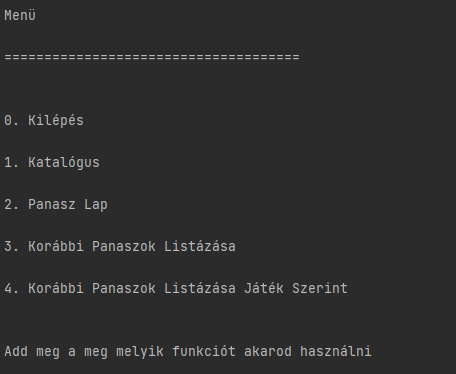
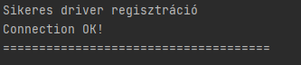
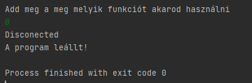
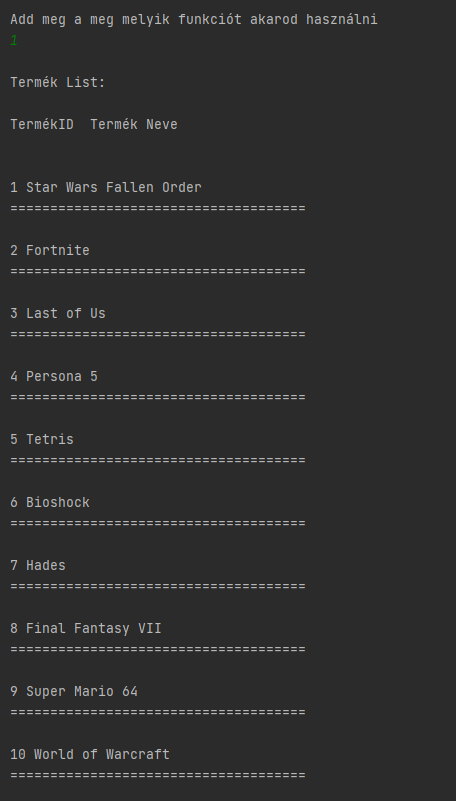
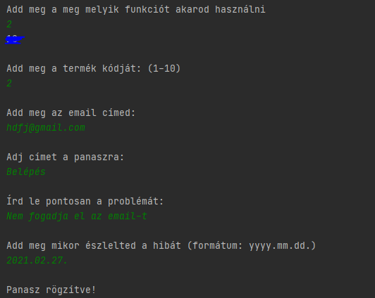
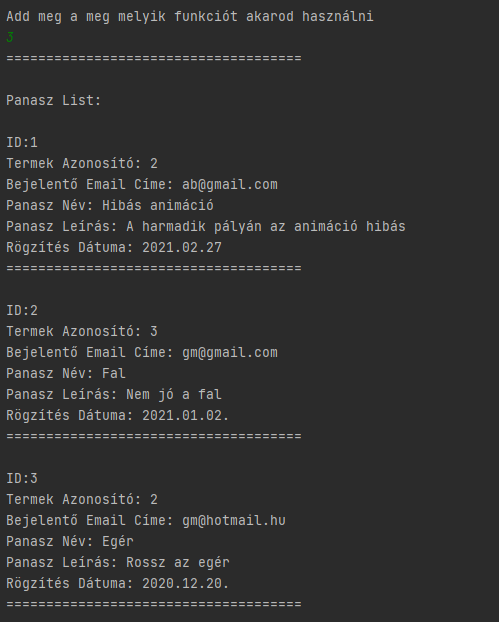
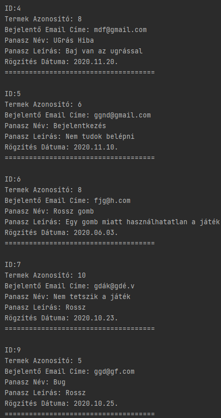
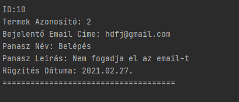
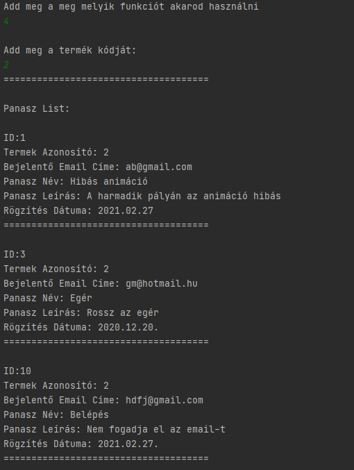

# Projekt Leírás:

Az én szorgalmi projektemben egy olyan alkalmazás vázat próbáltam megvalósítani amivel a játékokban fellelhető hibákat lehet követni mint termék - panasz nyilvántartás. Ezzel a rendszerrel lehetne a felhasználóktól érkező megjegyzéseket tárolni és nyomon követni a hibákat. 

# Relációs Séma:

# Réteg Funkcionális Terve:

Az alkalmazás jelen pillanatban konzolról indítva működik ahol egy kezdetleges menüt valósítottam meg. 

Első lépésben ellenőrizzük a JDBC driver-t és csatlakozunk a SQLite adatbázisokhoz.

Ezután megjelenik a  menü ahol a számát kiválasztva hajtja végre a feladatát. 

A 0-val bezárjuk a programot és megszakítjuk a kapcsolatot.

A 1-sel katalógussal tudjuk listázni a termék adatbázisban lévő termékeket.

A 2-sel be tudunk nyújtani egy panaszt amit az adatbázisban mentünk el. Először is meg kell adnunk a termék kódját, az email címet, a panasz címét, a panasz bővebb leírását és végül, hogy a panasz mikor lett felfedezve. A PanaszID-t a rendszer magától generálja és a dátum formátumot is ellenőrzi a rendszer. 

A 3-sal az eddigi összes panaszt ki tudjuk listázni az adatbázisból. 

A 4-sel pedig a TermékID-ja alapján tudjuk listázni a termékhez tartozó panaszokat. 

# Forráskód:
https://github.com/marcibaumel/O09CTQ_DB2_Szorgalmi_1/tree/master/src

